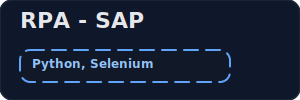
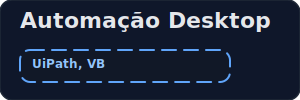
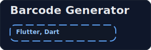
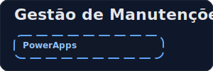
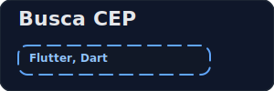

<h1 align="center">Juliano B. Silva (JB)</h1>

  <strong>Analista e Desenvolvedor | Especialista em Automação de Processos e Desenvolvimento Multiplataforma</strong>

  Com uma sólida carreira focada em otimização e inovação, especializo-me em desenvolver soluções de automação (RPA) com <strong>UiPath</strong> e <strong>Python</strong>, integradas ao ecossistema <strong>MS365</strong>, e em construir aplicações multiplataforma com <strong>Flutter/Dart</strong>. Minha expertise abrange desde a análise de processos até a implementação de sistemas robustos que geram eficiência e valor para o negócio.

  &nbsp&nbsp<space>
  

### 🚀 Principais Competências

  
  
  
  
  
  

### 🏆 Projetos em Destaque

  
  
  
  
  
  
  
  

<!-- 

 -->

### 🎓 Formação & Certificações

- **Tecnólogo em Análise e Desenvolvimento de Sistemas** - UNOPAR (2022)
- **Formação em Automação de Processos com RPA (UiPath)** - Cursando
- **Formação Contínua em Python, MS365, SQL, Git/GitHub** - Hashtag Treinamentos
- **Formação Contínua em Flutter/Dart** - Academia do Flutter

