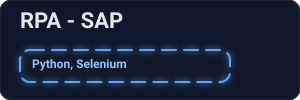
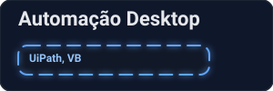
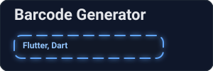

<h1 align="center">Juliano B. Silva (JB)</h1>

  <strong>Analista COE • Especialista em Automação de Processos • Desenvolvedor Multiplataforma</strong>

  

  Com foco em automação corporativa e desenvolvimento eficiente, atuo criando soluções RPA com <strong>UiPath</strong> e <strong>Python</strong>, integrando processos ao ecossistema <strong>Microsoft 365</strong> e desenvolvendo aplicações modernas e escaláveis com <strong>Flutter/Dart</strong>. Transformo desafios complexos em sistemas funcionais e soluções que realmente geram valor para o negócio.

***

<h2>🚀 Principais Competências</h2> 

***

<h2>📊 Visão geral</h2>

  

***

<h2>🏆 Projetos em Destaque</h2>

|  |  |  |  |
|----------------------------------------------------------------------------|----------------------------------------------------------------------------|----------------------------------------------------------------------------|----------------------------------------------------------------------------|
|  |  |  |  |

***

<h2>🎓 Formação & Certificações</h2>

- **Tecnólogo em Análise e Desenvolvimento de Sistemas** — UNOPAR (2022)
- **Automação de Processos com RPA (UiPath)** — Cursando
- **Formação Contínua em Python, MS365, SQL e Git/GitHub** — Hashtag Treinamentos
- **Formação Contínua em Flutter/Dart** — Academia do Flutter

***

<h2>📈 Atividade</h2>

  

***

  
  

  📧 <b>Email:</b> <a href="mailto:jbsilva.dev@outlook.com">jbsilva.dev@outlook.com</a>

